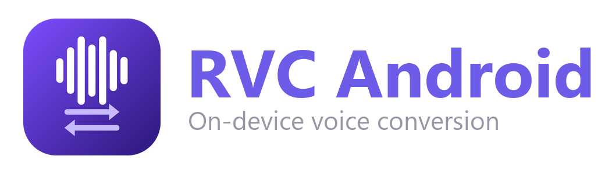
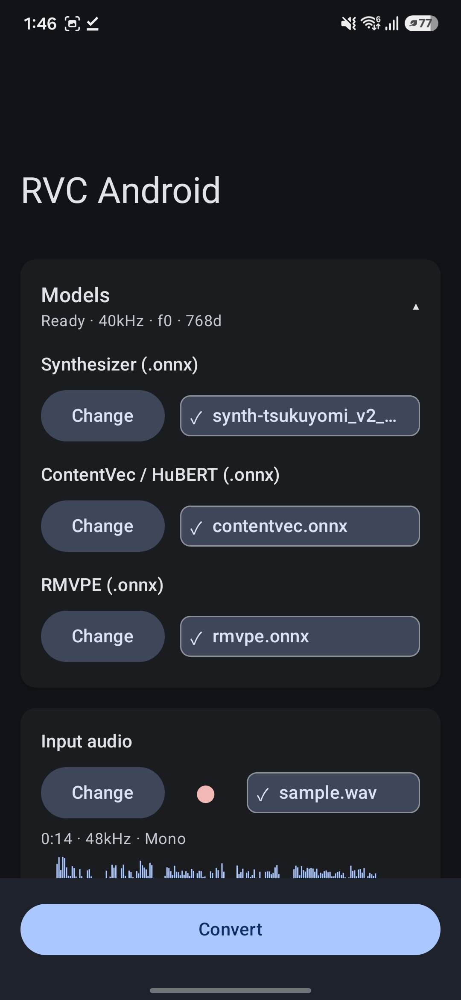
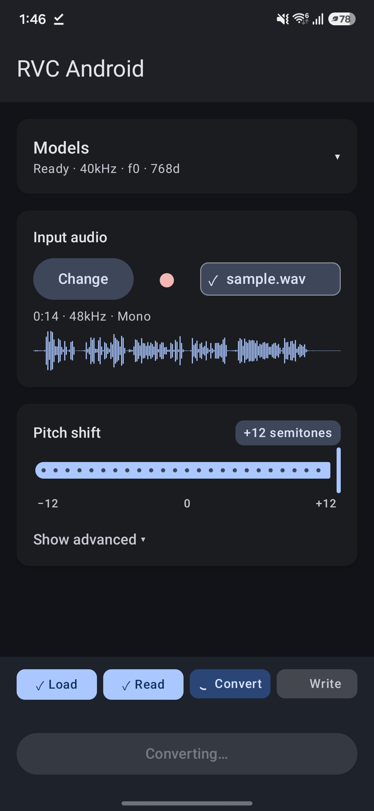
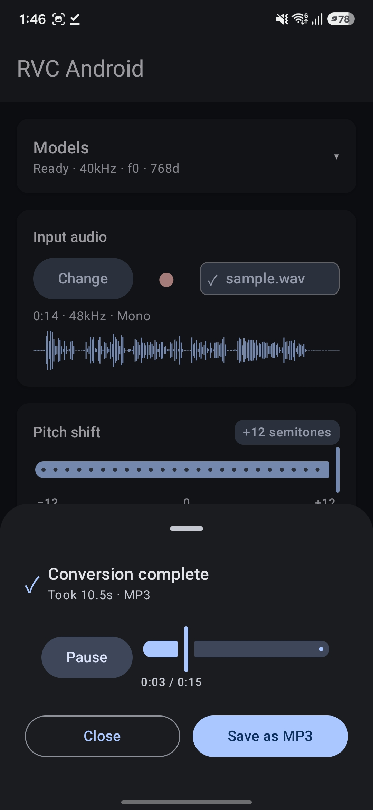
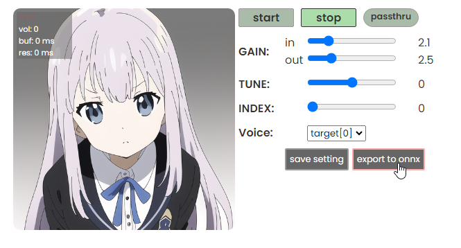

# RVC Android

<p align="center">
  <b>English</b> | <a href="./docs/README.ko.md">한국어</a>
</p>

<p align="center">
  
</p>

<p align="center">
  Voice conversion that stays on your phone — An Android
  app that swaps your voice using
  <a href="https://github.com/w-okada/voice-changer">voice-changer</a>-compatible
  RVC models.
</p>

> Unofficial community tool. Not affiliated with the
> [voice-changer](https://github.com/w-okada/voice-changer) project.

<p align="center">
  
  &nbsp;
  
  &nbsp;
  
</p>

## When you'd want this

Sometimes you just want to change a voice with the phone in your hand — no PC, no network.

- **Turn a recording into someone else's voice** — record a short clip from the
  mic or pick an audio file, and convert it with an RVC model you already have.
- **Keep your audio off the wire** — conversion and encoding both happen on the
  device. Nothing is uploaded, so it works in airplane mode.
- **Swap models whenever you like** — there's no voice baked into the app. Point
  it at whatever RVC ONNX model you want, right then and there.

## What it does

- **Changes your voice** — feed it a mic recording or an audio file (up to 60s)
  and it converts the speaker with your RVC model.
- **Exports the format you want** — save as WAV, MP3, AAC, M4A, FLAC, or OGG.
- **Lets you pick the models** — choose the Synth, HuBERT, and RMVPE models with
  a file picker. Recording straight from the mic works too.
- **Shows you the input first** — files over 60 seconds are rejected up front,
  and the input waveform is drawn as a thumbnail.
- **Plays the result right away** — when conversion finishes, a modal pops up so
  you can listen on the spot, then export with "Save as…".
- **Keeps your recent results** — past conversions stay in a history card, so you
  can reopen a result you dismissed and play or save it again.
- **Stays fast with the same models** — a loaded model is kept warm in memory, so
  re-converting with the same combination skips reopening the model.

## What you need

- **Device**: arm64-v8a, Android 12+ (`minSdk 31`, `targetSdk 36`)
- **Permission**: `RECORD_AUDIO`, only when you record from the mic (not needed
  for file input)
- **Three models** — all exported as ONNX from the voice-changer tooling. All
  three slots must be filled before a conversion starts.

| Slot | Model | Good to know |
|------|-------|--------------|
| **Synth** | RVC synthesizer ONNX | Must be the `export2onnx.py` output format from voice-changer. The model has to carry a `custom_metadata_props["metadata"]` JSON (`samplingRate` / `f0` / `embChannels` / `embedder` / `embOutputLayer` / `useFinalProj`). Without it, the model is rejected with "synth has no embedded metadata". |
| **HuBERT** | ContentVec / HuBERT embedder | Like voice-changer's `content_vec_500.onnx`, exposing the `unit12` (768d, v2), `units9` (256d, v1), and `unit12s` outputs. Which one is used is chosen automatically from the Synth metadata. |
| **RMVPE** | Pitch extractor | Takes `waveform[1,N] f32` and `threshold[1] f32` inputs. Required for f0 models. |

You get the Synth model by hitting **export to onnx** in the
[voice-changer](https://github.com/w-okada/voice-changer) desktop client — that's
what bakes the required metadata into the file.

<p align="center">
  
</p>

## Getting started

To build and install it yourself:

```sh
./gradlew :app:assembleDebug
```

Once it's installed:

1. Open the app and pick the **Synth · HuBERT · RMVPE** models with the file
   picker.
2. Import an audio file or **record from the mic** (up to 60s).
3. If you like, adjust the **pitch (f0UpKey)** and **Speaker ID**.
4. Tap **Convert**, then listen to the result and export it with **Save as…**.

## Good to know

- It all runs **on the device, offline** — no account, no cloud, and your audio
  never leaves the phone.
- Input is capped at **60 seconds**; longer files are filtered out before
  conversion.
- Models can be large, so the app runs with `largeHeap` and streams the model
  file to cache to read it via mmap (avoiding Java-heap OOM).

## Under the hood

The conversion pipeline (see `inference/RvcPipeline.kt`):

1. Decode input → resample to 16 kHz mono (linear interpolation)
2. HuBERT/ContentVec → `feats[1, T, C]` (50 fps)
3. RMVPE → `pitchf` + mel `f0_coarse` quantization that matches voice-changer
   bit-for-bit, with the `f0UpKey` semitone shift applied
4. Embeddings upsampled 50 fps → 100 fps, 2× nearest (compatible with PyTorch
   `F.interpolate(scale_factor=2)`)
5. Synthesizer → audio, clipped to `[-1, 1]`
6. Encode with ffmpeg-kit-audio (or in-process WAV) → SAF "Save as…"

Module layout:

```
app/src/main/java/com/ouor/rvcandroid/
├── MainActivity.kt
├── audio/         # decode/encode, resample, recording, preview player, history LRU
├── inference/     # ORT session cache, HuBERT/RMVPE/Synth wrappers, metadata parser
└── ui/            # Compose screen + ConversionViewModel (StateFlow-based)
```

Tech stack:

- **Kotlin** + **Jetpack Compose / Material3** — UI
- **ONNX Runtime Android** — inference
- **ffmpeg-kit-audio** (community fork, LGPL) — MP3 / AAC / M4A / FLAC / OGG codecs
- **AndroidX Media3 ExoPlayer** — previewing the result